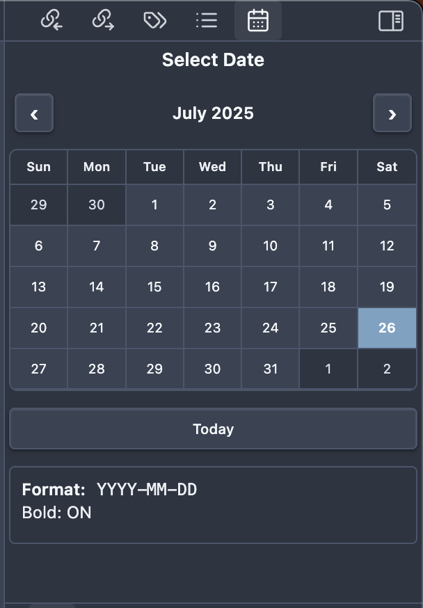

# CopyDate Calendar - Obsidian Plugin

A convenient Obsidian plugin that provides an interactive calendar sidebar for quickly inserting formatted dates into your notes. Say goodbye to manually typing dates - just click on a date and it's instantly inserted at your cursor position!

## Background

When taking notes, journaling, or working with dated content in Obsidian, manually typing dates can become repetitive and time-consuming. Whether you're creating daily notes, logging events, or referencing specific dates, the constant need to type out formatted dates disrupts your writing flow.

CopyDate Calendar was created to solve this exact problem by providing a beautiful, always-accessible calendar that lets you insert perfectly formatted dates with a single click. No more interrupting your thoughts to type out "January 25, 2025" or remember the exact format you prefer.

## Plugin preview



*The CopyDate Calendar plugin provides an intuitive sidebar interface for quick date insertion. Simply click any date to insert it at your cursor position with your preferred formatting.*

## Features

### 🗓️ Interactive Calendar Sidebar
- **Sidebar Integration**: Seamlessly integrates with Obsidian's sidebar for quick access
- **Month Navigation**: Easy navigation between months with arrow buttons
- **Today Highlighting**: Current date is clearly highlighted for easy reference
- **Click to Insert**: Simply click any date to insert it at your cursor position

### 📝 Flexible Date Formatting
- **Multiple Format Options**:
  - `YYYY-MM-DD` (2025-01-25)
  - `DD-MM-YYYY` (25-01-2025)
  - `DD/MM/YYYY` (25/01/2025)
  - `MM/DD/YYYY` (01/25/2025)
  - `MMMM DD, YYYY` (January 25, 2025)
  - `DD MMMM YYYY` (25 January 2025)
  - **Custom Format**: Define your own using moment.js format tokens

### ✨ Advanced Formatting Options
- **Bold Formatting**: Automatic bold formatting option (`**2025-01-25**`)
- **Live Preview**: Real-time preview of how your dates will appear
- **Smart Detection**: Automatically finds active note for date insertion

### ⚙️ User-Friendly Settings
- **Intuitive Settings Panel**: Easy-to-use settings in Obsidian's settings tab
- **Format Preview**: See exactly how your dates will look before inserting
- **Persistent Settings**: Your preferences are saved and restored

## Installation

### From Obsidian Community Plugins (Recommended)
1. Open Obsidian Settings
2. Navigate to Community Plugins
3. Search for "CopyDate Calendar"
4. Click Install and then Enable

### Manual Installation
1. Download the latest release from GitHub
2. Extract the files to your Obsidian plugins folder:
   - Windows: `%APPDATA%\Obsidian\plugins\copydate-calendar\`
   - Mac: `~/Library/Application Support/obsidian/plugins/copydate-calendar/`
   - Linux: `~/.config/obsidian/plugins/copydate-calendar/`
3. Enable the plugin in Obsidian Settings > Community Plugins

## Usage

### Quick Start
1. **Open the Calendar**: Click the calendar icon in the ribbon or use the command palette
2. **Navigate**: Use the arrow buttons to navigate between months
3. **Insert Date**: Click any date to insert it at your cursor position
4. **Customize**: Access settings via Settings > CopyDate Calendar to customize format and styling

### Detailed Usage

#### Opening the Calendar
- **Ribbon Icon**: Click the calendar icon in the left ribbon
- **Command Palette**: Search for "Open Calendar" in the command palette
- **Sidebar**: The calendar opens in the right sidebar by default

#### Inserting Dates
1. **Position Your Cursor**: Click where you want the date in your note
2. **Select Date**: Click the desired date in the calendar
3. **Automatic Insertion**: The formatted date is instantly inserted at cursor position

#### Navigation
- **Previous/Next Month**: Use the `‹` and `›` buttons
- **Today Button**: Click "Today" to quickly select the current date
- **Visual Indicators**: 
  - Today's date is highlighted in accent color
  - Days from previous/next month appear dimmed

#### Format Display
The bottom of the calendar shows:
- **Current Format**: The active date format being used
- **Bold Status**: Whether bold formatting is enabled
- **Live Settings**: Updates automatically when you change settings

### Settings Configuration

#### Date Format Options
1. **Access Settings**: Go to Settings > CopyDate Calendar
2. **Choose Format**: Select from predefined formats or choose "Custom"
3. **Custom Formats**: Use moment.js tokens like:
   - `YYYY` for 4-digit year
   - `MM` for 2-digit month
   - `DD` for 2-digit day
   - `MMMM` for full month name
   - `MMM` for abbreviated month name

#### Bold Formatting
- **Toggle**: Enable/disable bold formatting for inserted dates
- **Result**: When enabled, dates are wrapped in `**` for Markdown bold styling
- **Preview**: Settings show real-time preview of formatted output

#### Preview System
- **Live Updates**: Preview updates as you change settings
- **Real Example**: Shows actual formatted version of today's date
- **Error Handling**: Invalid custom formats show helpful error messages

## Use Cases

### 📅 Daily Notes & Journaling
Perfect for daily note templates, journal entries, and habit tracking where you frequently reference dates.

### 📚 Research & Documentation
Ideal for academic writing, research notes, and documentation where precise date references are crucial.

### 📋 Project Management
Great for project timelines, meeting notes, and task tracking with specific deadlines.

### 📝 Content Creation
Useful for blog posts, articles, and content that requires date references or publication dates.

## Keyboard Shortcuts

Currently, the plugin focuses on mouse/touch interaction for the best calendar experience. Future versions may include keyboard shortcuts for power users.

## Troubleshooting

### Date Not Inserting
- **Check Active Note**: Ensure you have a note open and the cursor is positioned
- **Click in Editor**: Make sure you've clicked in the editor area before selecting a date
- **Reload Plugin**: Try disabling and re-enabling the plugin if issues persist

### Format Issues
- **Custom Format Errors**: Check moment.js documentation for valid format tokens
- **Preview Help**: Use the preview in settings to verify your format works
- **Reset to Default**: Choose a predefined format if custom format isn't working

### Calendar Not Showing
- **Ribbon Icon**: Look for the calendar icon in the left ribbon
- **Sidebar**: Check if the calendar is already open in the right sidebar
- **Plugin Status**: Verify the plugin is enabled in Community Plugins settings

## Development

### Building from Source
```bash
# Clone the repository
git clone https://github.com/ashonko/copydate-calendar.git

# Install dependencies
npm install

# Build the plugin
npm run build
```

### Development Setup
```bash
# Install dependencies
npm install

# Start development mode
npm run dev
```

## Contributing

Contributions are welcome! Please feel free to submit a Pull Request. For major changes, please open an issue first to discuss what you would like to change.

### Areas for Contribution
- Additional date format presets
- Keyboard navigation
- Localization/internationalization
- Mobile optimization
- Accessibility improvements

## License

This project is licensed under the MIT License - see the [LICENSE](LICENSE) file for details.

## Support

If you find this plugin helpful, consider:
- ⭐ Starring the repository
- 🐛 Reporting bugs or requesting features
- 💡 Contributing code or documentation
- ☕ Supporting the developer

## Changelog

### Version 1.0.0
- Initial release
- Interactive calendar sidebar
- Multiple date format options
- Bold formatting toggle
- Live preview system
- Settings panel integration

---

**Happy note-taking! 📝✨**
